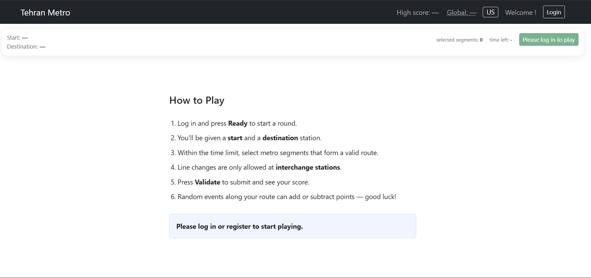
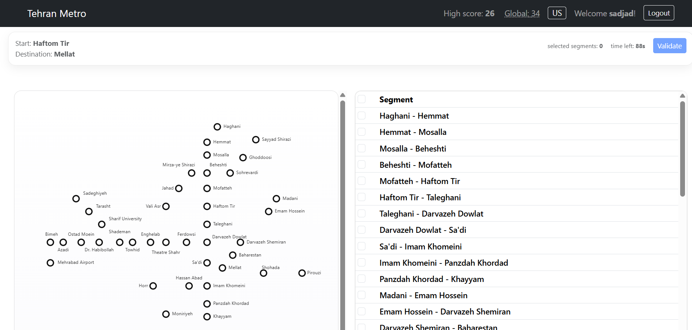

# Tehran Metro Game

An interactive metro routing game built with **React 19 + Node 24 + Express + SQLite + Passport.js**.

Players must find the correct route between two Tehran Metro stations by selecting the right track segments — all against the clock.

---

## Prerequisites

- Node 24.x (LTS)
- `nodemon` installed globally (`npm install -g nodemon`)

---

## Setup & Run

### 1. Install root dependencies

```bash
npm install
```

### 2. Server

```bash
cd server
npm install
nodemon index.js
```

The server starts on **http://localhost:3001**

### 3. Client

```bash
cd client
npm install
npm run dev
```

The React app starts on **http://localhost:5173**

### 4. Run both together (from root)

```bash
npm run dev
```

This uses `concurrently` to start both the server and the client simultaneously.

---

## Project Structure

```
project/
├── client/                  # React 19 frontend (Vite)
│   └── src/
│       ├── App.jsx           # Root component & game state
│       ├── api.js            # Fetch wrapper for all API calls
│       ├── config.js         # Game-level constants (timer, test mode, difficulty)
│       ├── hooks/
│       │   └── useGameLogic.js   # Core game state & round logic
│       └── components/
│           ├── TehranMetroMap.jsx   # SVG metro map renderer
│           ├── MetroEdgesTable.jsx  # Selectable edge list
│           ├── PlayHud.jsx          # Sticky HUD (timer, stations, buttons)
│           ├── AppNavbar.jsx        # Top navigation bar
│           ├── GameInstructions.jsx # Instructions shown to guests
│           ├── RegisterForm.jsx     # Registration form
│           └── utils.js             # Shared helpers (e.g. getStationLabel)
│
└── server/                  # Node.js + Express backend
    ├── index.js              # App entry point, middleware, route mounting
    ├── db.js                 # Single DB instance + exported helpers
    ├── routes/
    │   ├── auth.js           # /api/users, /api/sessions
    │   ├── metro.js          # /api/metro/graph, /api/metro/edges
    │   ├── events.js         # /api/events
    │   └── game.js           # /api/games
    └── db/
        ├── users.db.js       # Users schema, seed, queries
        ├── metro.db.js       # Metro lines, nodes, edges seed & queries
        ├── events.db.js      # Random events seed & queries
        └── game.db.js        # Game sessions schema & queries
```

---

## Configuration

All game-level constants live in [`client/src/config.js`](client/src/config.js):

| Constant               | Default       | Description                                              |
|------------------------|---------------|----------------------------------------------------------|
| `DEFAULT_TIMER`        | `90`          | Seconds per round                                        |
| `TEST_MODE`            | `false`        | If `true`, always uses hardcoded start/destination       |
| `START_STATION_ID`     | `'haghani'`   | Test mode start station                                  |
| `DESTINATION_STATION_ID` | `'sohrevardi'` | Test mode destination station                         |
| `GAME_LEVEL`           | `'medium'`      | `'easy'` \| `'medium'` \| `'hard'`                      |

### Difficulty Levels

| Level    | Edge order | Line column | Stations highlighted |
|----------|-----------|-------------|----------------------|
| `easy`   | Sorted    | Visible     | Yes                  |
| `medium` | Sorted    | Hidden      | No                   |
| `hard`   | Shuffled  | Hidden      | No                   |

---

## How to Play

1. **Log in or register** to access the game.
2. Press **Ready** to start a round — a random start and destination station are assigned.
3. Within the time limit, **select metro track segments** in the edge table or on the map to build a valid route.
4. Line changes are only allowed at **interchange stations** (marked differently on the map).
5. Press **Validate** to submit your route and see your score.
6. **Random events** are applied to your route and add or subtract points.
7. Press **Restart** to return to the full map and start a new round.

---

## Metro Data

The metro graph covers **Lines 1–4** of the Tehran Metro with active stations and edges. Many outer stations are commented out in [`server/db/metro.db.js`](server/db/metro.db.js) and can be enabled by uncommenting the relevant `S(...)` node and `E(...)` edge entries.

| Line | Color       | Route (active portion)                       |
|------|-------------|----------------------------------------------|
| L1   | Red         | Haghani → Khayyam                            |
| L2   | Dark Blue   | Madani → Sadeghiyeh                          |
| L3   | Cyan        | Sayyad Shirazi → Rahahan                     |
| L4   | Yellow      | Pirouzi → Mehrabad Airport                   |

**Interchange stations** (shared between lines):
- `beheshti` — L1 / L3
- `imam-khomeini` — L1 / L2
- `darvazeh-dowlat` — L1 / L4
- `darvazeh-shemiran` — L2 / L4
- `shademan` — L2 / L4
- `teatr-shahr` — L3 / L4

---

## Events

Nine random events (E01–E09) can be triggered during a round, each with a score modifier:

| Code | Title (EN)                 | Score |
|------|----------------------------|-------|
| E01  | Getting Robbed             | −4    |
| E02  | Crowded platform           | −3    |
| E03  | Signal delay               | −2    |
| E04  | Escalator outage           | −1    |
| E05  | Quiet journey              |  0    |
| E06  | Train arrived early        | +1    |
| E07  | Helpful staff              | +2    |
| E08  | Kind passenger             | +3    |
| E09  | Meeting the love of life   | +4    |

---

## Seeded Users

| Name   | Email               | Password   |
|--------|---------------------|------------|
| sadjad | sadjad@example.com  | sadjad1234 |
| ali    | ali@example.com     | ali1234    |
| momo   | momo@example.com    | momo1234   |

---

## API Endpoints

### Auth

| Method | Path                      | Auth | Description                  |
|--------|---------------------------|------|------------------------------|
| POST   | `/api/users`              | No   | Register (auto-login)        |
| POST   | `/api/sessions`           | No   | Login                        |
| GET    | `/api/sessions/current`   | Yes  | Get current logged-in user   |
| DELETE | `/api/sessions/current`   | Yes  | Logout                       |

### Metro

| Method | Path                  | Auth | Description                          |
|--------|-----------------------|------|--------------------------------------|
| GET    | `/api/metro/graph`    | Yes  | Full graph (nodes + edges + lines)   |
| GET    | `/api/metro/edges`    | Yes  | Edge list (optional `?line_id=L1`)   |

### Events

| Method | Path          | Auth | Description        |
|--------|---------------|------|--------------------|
| GET    | `/api/events` | Yes  | List all 9 events  |

### Games

| Method | Path          | Auth | Description              |
|--------|---------------|------|--------------------------|
| POST   | `/api/games`  | Yes  | Save a completed round   |
| GET    | `/api/games`  | Yes  | List user's game history |

---

## Language Support

The UI supports **English** and **فارسی (Persian)**. Toggle between them using the language button in the navbar. All station names, event titles, HUD labels, and instructions are


## Screenshots
 
Here is a screenshot of the play guide:


Also a screenshot of the game in action:
